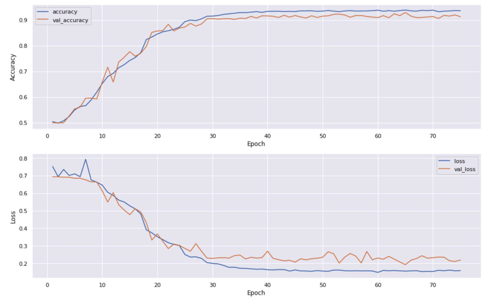

dogs-vs-cats
-----
本项目根据[Kaggle](https://www.kaggle.com/c/dogs-vs-cats/)上的一个比赛改编。

### 项目代码
- cnn_model.ipynb 模型的搭建、训练和评估等
- split_dataset.py 对原始数据进行划分

### 注意点
- 训练集、验证集和测试集是固定的
- 为了提升准确率，可以将整个数据集打乱重新划分
- 神经网络的结构未必科学，可能需要改变网络结构来提升准确率
- 训练好的模型文件放在了model_data文件夹里

### 模型性能
- 测试集上的准确率：92.94%（还算凑合...）
- 训练曲线

